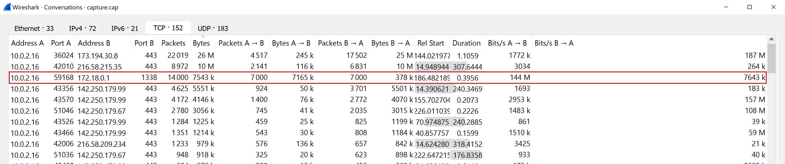
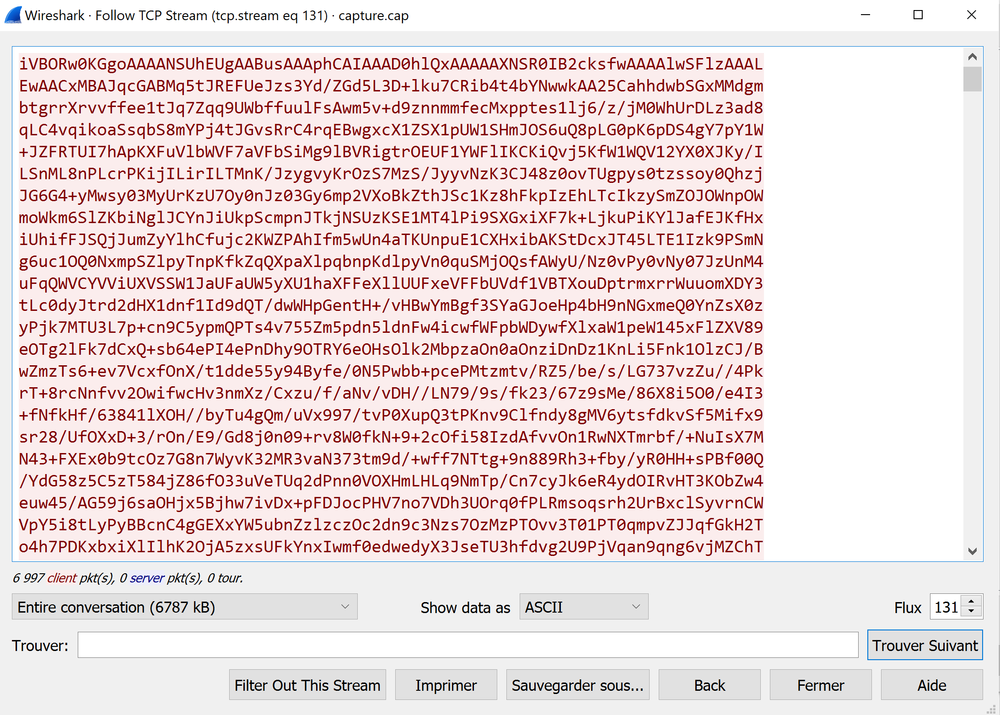

# C-3PO

Category: Forensics

## Challenge

For this challenge, the CEO of a company suspects that his phone exfiltrates
images to suspicious servers. We get a network capture of his phone and we need to
find the suspicious data.

- [capture](capture.cap)

## Write-up

To find information in this capture, we can use WireShark.

We can use Wireshark to examine the TCP conversations in this capture:
- Statistics > Conversations > TCP



Then, we have to look into these conversations and in onne of them, we find this
conversation that seems like a random pile of characters:



This [data](data.txt) seems to be base 64 encoded and is big enough to be an image.

Let's try to analyse it with [CyberChef](https://gchq.github.io/CyberChef/)

With the Detect file type option, CyberChef finds a base 64 PNG image:
```text
File type:   Portable Network Graphics image (under Base64)
Extension:   B64
MIME type:   application/octet-stream
```

We can now render it with CyberChef using the Render Media option with source B64.

