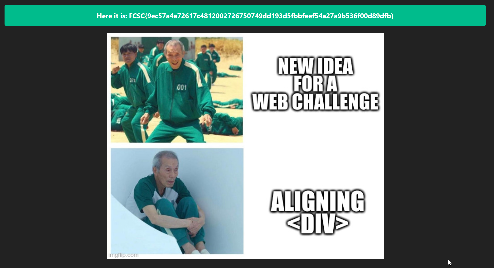

# Header

Categories: intro, web

## Challenge
A web page is available with the address:
https://header.france-cybersecurity-challenge.fr.

## Write-up
On this page, by clicking the _Source_ button, we can see the
the source code of the main Node.js file.

In this code, we find:
```js
app.get('/', async (req, res) => {
    var verif = req.header("X-FCSC-2022");
    if (verif == "Can I get a flag, please?") {
        var flag = fs.readFileSync("flag.txt");
        res.status(200);
        res.render("pages/index", {
            type: "success",
            msg: "Here it is: " + flag,
        });
        return res.end();
    } else {
        res.status(200);
        res.render("pages/index", {
            type: "warning",
            msg: "No flag for you. Want a meme instead?",
        });
        return res.end();
    }
});
```
By reading this code, we can see that if the header contains an entry: 
X-FCSC-2022 with the value: "Can I get the flag, please?"

To add the entry to the header of our request, we can use BurpSuite:

```text
GET / HTTP/1.1
Host: header.france-cybersecurity-challenge.fr
User-Agent: Mozilla/5.0 (Windows NT 10.0; Win64; x64; rv:100.0) Gecko/20100101 Firefox/100.0
Accept: text/html,application/xhtml+xml,application/xml;q=0.9,image/avif,image/webp,*/*;q=0.8
Accept-Language: fr,fr-FR;q=0.8,en-US;q=0.5,en;q=0.3
Accept-Encoding: gzip, deflate
Referer: https://header.france-cybersecurity-challenge.fr/source
Upgrade-Insecure-Requests: 1
Sec-Fetch-Dest: document
Sec-Fetch-Mode: navigate
Sec-Fetch-Site: same-origin
Sec-Fetch-User: ?1
If-None-Match: W/"7c1-u7mDevO2lXCpLPilktquuTxmg6U"
Te: trailers
Connection: close
X-FCSC-2022: Can I get a flag, please?
```

The response from the server shows the flag:


