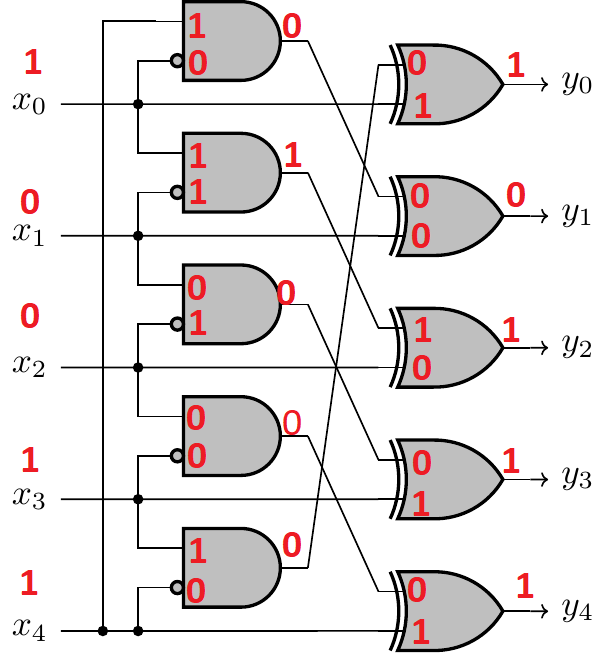

# Ne pas jeter l'éponge

Categories: intro, hardware

## Challenge
For this challenge, we get a logical circuit and
an input and we have to find the output.
The input is: 10011
And the circuit is:

## Write-up

To find the output, we can compute by hand the output of each logical
gate:

We get the output 10111.