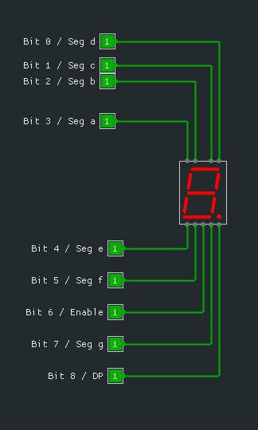
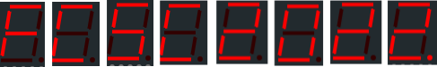

# Seven Sins

Categories: intro, hardware

## Challenge
For this challenge, we get a seven segment number display:

With a 9-bit input for each number displayed.
The objective for this challenge is to display: FCSC2022.

## Write-up

First, we have to find out which bit controls what bar.

This can be done using the exemple given with the challenge:

with the input: 011100100111111110111101110, we get the display: 789

We can find that:
- bit 0 controls the bottom bar
- bit 1 controls the bottom-right bar
- bit 2 controls the top-right bar
- bit 3 controls the top bar
- bit 4 controls the bottom-left bar
- bit 5 controls the top-left bar
- bit 6 is the enable bit, it must always be 1
- bit 7 is the middle bar
- bit 8 is the dot

To display FCSC2022., we have to give the input:
- F : 000111110
- C : 100111100
- S : 110101110
- C : 100111100
- 2 : 101110110
- 0 : 111111100
- 2 : 101110110
- 2.: 101110111

The flag is:
000111110100111100110101110100111100101110110111111100111111100101110110101110111