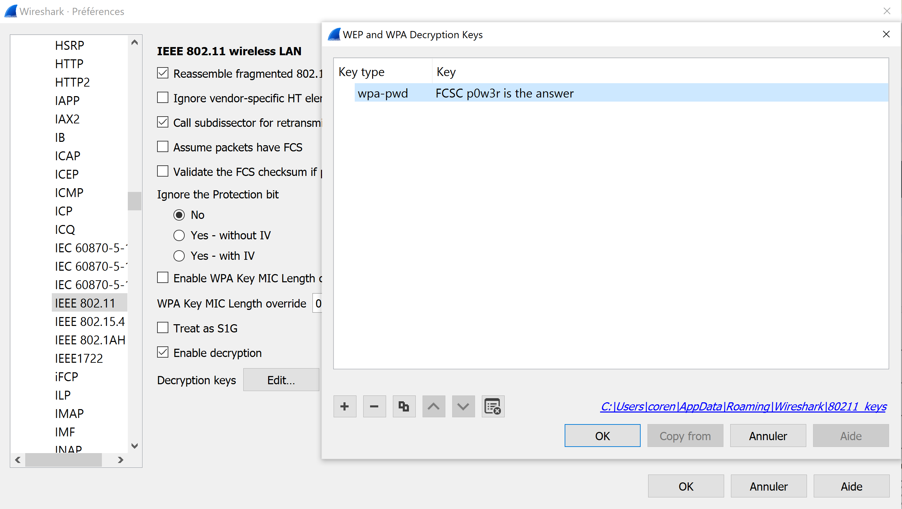

# WIFI
Categories: intro, networking

## Challenge
For this challenge, we get a [network capture](intro-wifi.pcap), 
and a WIFI password: "FCSC p0w3r is the answer" and we have to find 
something interesting in the capture.

## Write-up
The first step is to open the capture using WireShark, then, we have to add
the password to our list of decryption keys. This can be done by going to:

Edit > Preferences > Protocols > IEEE 802.11 > Decryption Keys



We can then look at the different conversation by going to:

Statistics > Conversations > TCP

There should only be one conversation, we can click Follow Stream to see
the content of the conversation and we get:
```text
GET /my_precious HTTP/1.1
User-Agent: Wget/1.21
Accept: */*
Accept-Encoding: identity
Host: 192.168.21.224
Connection: Keep-Alive

HTTP/1.0 200 OK
Server: SimpleHTTP/0.6 Python/3.9.2
Date: Fri, 18 Mar 2022 19:54:54 GMT
Content-type: application/octet-stream
Content-Length: 71
Last-Modified: Fri, 18 Mar 2022 19:52:33 GMT

FCSC{60d67d7de8aadb7d1241de9a6fdf9148982d2363eab88e862bb98402ac835c8f}
```